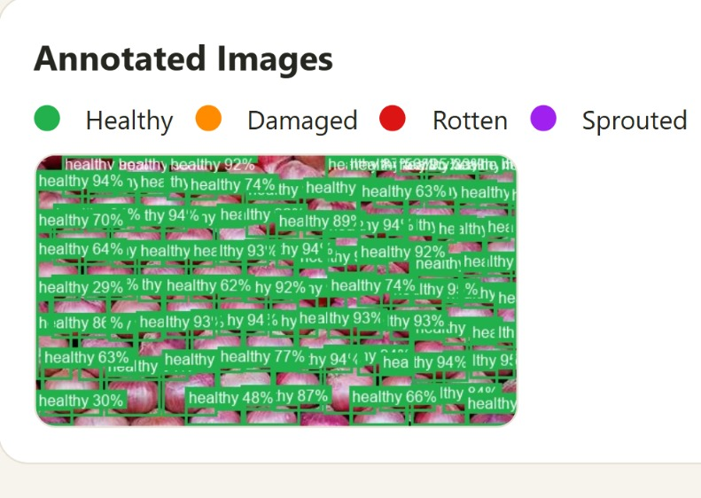
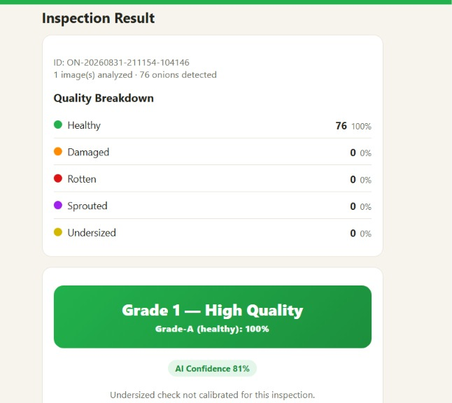

# GradeLens AI — Onion Quality Grading Platform

**[Demo video](https://drive.google.com/file/d/1W0t8OEfG1TnkzP_I9HhQb1T0AlgZ2C4P/view?usp=drivesdk)**

AI-powered onion batch inspection: photograph a batch, and get automatic
per-onion detection, a **Grade 1 / Grade 2 / URS** rating, a ₹/quintal price
estimate, and an auditable PDF report — powered by a custom-trained YOLO
model.

## Architecture

```
frontend/ (PWA)   ┐
                   ├──►  FastAPI backend  ──►  YOLO inference  ──►  grading & pricing rules  ──►  SQLite history + PDF report
flutter_app/       ┘
```

- **`frontend/`** — web app / PWA, no build step.
- **`flutter_app/`** — Flutter app (Android, iOS, desktop, web).
- **`backend/`** — FastAPI server. Always runs the newest trained checkpoint
  (`onion-grading-v*.pt`), applies grading + pricing as plain, editable
  Python rules (not a second AI model), and stores every inspection with a
  downloadable PDF report.

## Key features

- Single-photo or multi-photo batch inspection
- Per-onion detection with color-coded annotations — healthy / damaged /
  rotten / sprouted / undersized
- Grading thresholds and pricing are configurable from the Settings screen,
  no retraining needed
- Low-confidence detections are flagged for manual review
- Inspection history, analytics dashboard, and PDF reports per inspection

## Example output

| Annotated detection | Inspection result |
|---|---|
|  |  |

## Known limitations

- **Sprouted** detection is trained on very few real examples — treat it as
  low-confidence in practice.
- **Rotten** detection is based on surface-spot annotations, not
  whole-onion judgments.
- No cross-photo duplicate detection in batch mode yet.
